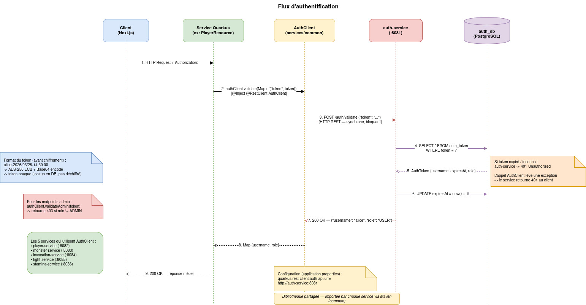

# AuthClient - Partage de code via le module `common`

## Le problème

X services différents doivent tous répondre à la même question avant de traiter une requête :
> *"Ce token est-il valide ? Et si oui, qui est l'utilisateur ?"*

Solution naïve : écrire la logique de validation dans chacun des services
Problème : duplication de code, risque d'incohérence, maintenance difficile, ...

## La solution : le module `common`

`services/common` est une **bibliothèque Java partagée**, pas un service. Elle ne tourne pas, elle ne répond pas à des requêtes, elle fournit du code réutilisable que les autres services importent.

```
services/
├── common/              # bibliothèque partagée (jar Maven)
│   └── AuthClient.java  # l'interface d'auth
├── player-service/      # importe common
├── ...
└── stamina-service/     # importe common
```

Chaque service déclare `common` comme dépendance Maven dans son `pom.xml` :

```xml
<dependency>
    <groupId>fr.gatcha</groupId>
    <artifactId>common</artifactId>
    <version>1.0.0-SNAPSHOT</version>
</dependency>
```

## Ce que contient `common`

`common` contient tout ce qui est utilisé par plusieurs services :

| Contenu         | Usage                                                                                    |
| --------------- | ---------------------------------------------------------------------------------------- |
| `AuthClient`    | Validation de token                                         |
| POJOs Kafka     | Les événements échangés entre services (`MonsterCreatedEvent`, `FightResultEvent`, etc.) |
| `Element` enum  | `FEU`, `EAU`, `VENT`, `TERRE`                                                            |
| `UserRole` enum | `USER`, `ADMIN`                                                                          |

## `AuthClient` - l'interface partagée

```java
// services/common/src/main/java/fr/gatcha/common/client/AuthClient.java

@RegisterRestClient(configKey = "auth-api")
@Path("/auth")
public interface AuthClient {

    @POST
    @Path("/validate")
    Map<String, String> validate(Map<String, String> body);

    @POST
    @Path("/validate-admin")
    Map<String, String> validateAdmin(Map<String, String> body);
}
```

C'est une **interface uniquement** - aucune implémentation. L'annotation `@RegisterRestClient` (MicroProfile) génère automatiquement le client HTTP à partir des annotations JAX-RS. Appeler `authClient.validate(...)` déclenche un `POST /auth/validate` vers `auth-service`.

## Utilisation dans un service

Grâce à Maven, n'importe quel service peut injecter `AuthClient` avec deux lignes :

```java
// Dans PlayerResource, FightResource, MonsterResource, etc.

@Inject
@RestClient
AuthClient authClient;
```

Puis l'utiliser à chaque endpoint protégé :

```java
@GET
@Path("/me")
public Response getMyProfile(@HeaderParam("Authorization") String token) {
    Map<String, String> claims = authClient.validate(Map.of("token", token));
    String username = claims.get("username"); // "alice"
    String role     = claims.get("role");     // "USER" ou "ADMIN"
    // ...
}
```

Un seul endroit où l'interface est définie. Cinq services qui l'utilisent de façon identique.

## Ce que fait `auth-service` à la réception

1. Cherche le token en base de données (`auth_db`)
2. Si expiré ou inconnu -> `401 Unauthorized`
3. Si valide -> prolonge l'expiration de 1h, retourne `{"username": "alice", "role": "USER"}`

## Pourquoi synchrone et non via Kafka ?

Tous les autres échanges inter-services passent par Kafka (asynchrone). L'auth fait exception : on ne peut pas continuer à traiter une requête sans savoir d'abord si l'utilisateur est autorisé. La validation doit être **bloquante**

## Diagramme

